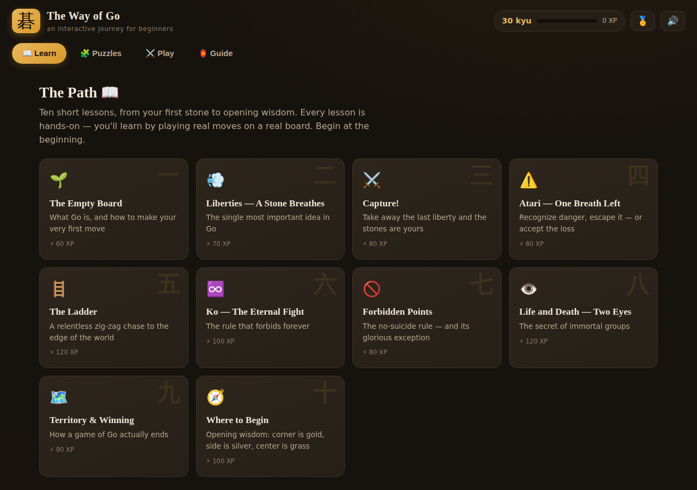
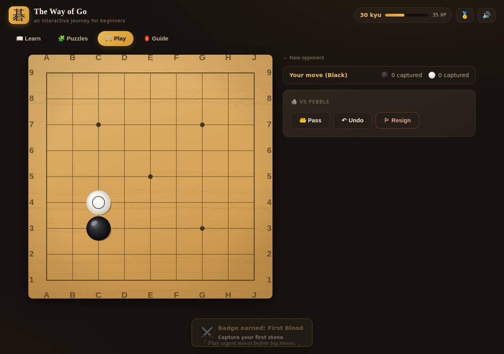

# 碁 The Way of Go

**A beautiful, interactive journey for absolute beginners — from your very first
stone to your first victory.**

No installs, no accounts, no dependencies. Open `index.html` and start playing.



## What's inside

### 📖 The Path — ten hands-on lessons
Not videos, not walls of text: every concept is taught **on a live board with
real rules**. You'll capture stones, escape atari, chase a fleeing group down a
full ladder, get personally rejected by the ko rule, burst a one-eyed group,
and build an immortal two-eyed one — with Sensei Hoshi 🐢 cheering you on.

> Liberties → Capturing → Atari → Ladders → Ko → Suicide rule → Two eyes →
> Territory & komi → Opening wisdom

### 🧩 The Dojo — 14 graded puzzles
Classic beginner tsumego, from one-move captures to the snapback, the net
(geta), double atari, vital points, and a full ladder hunt. Wrong answers are
refuted on the board; first-try streaks earn badges.

### ⚔️ The Arena — play real games
Full 9×9 games against three AI personalities — gentle **Pebble 🪨**, solid
**River 🌊**, and stern **Mountain ⛰️** — with live coaching commentary
("⚠️ your group is in atari!"), pass/undo/resign, dead-stone marking, and
proper area scoring with komi.



### 🏮 The Lantern — a quiet reference
The rules on one hand, growth instincts, a glossary, Go etiquette, and where
to find human opponents when you're ready.

### Progress that feels like a journey
XP for everything, a rank that climbs from **30 kyu toward 10 kyu**, fourteen
achievement badges, confetti where deserved, rotating Go proverbs, and
synthesized stone-on-wood sounds (WebAudio — no audio files). Everything is
saved locally in your browser.

## Running it

Just open `index.html` in any modern browser — or serve the folder:

```bash
python3 -m http.server 8000
# then visit http://localhost:8000
```

Works offline (the one external request, Google Fonts, degrades gracefully).

## Under the hood

Hand-written vanilla JavaScript — zero runtime dependencies.

| File | What it is |
|---|---|
| `js/engine.js` | Complete Go rules engine: captures, suicide rule, positional superko, undo, area scoring |
| `js/board.js` | Canvas goban: procedural wood grain, shaded stones, animations, marks |
| `js/ai.js` | Heuristic AI with three personalities (captures, defends atari, respects eyes, opens on the third line) |
| `js/lessons.js` | The curriculum as pure data — every scripted sequence is engine-verified |
| `js/puzzles.js` | Puzzle positions and solution trees — also engine-verified |
| `js/sound.js` | All sounds synthesized with WebAudio |
| `js/app.js` | Views, lesson/puzzle players, game vs AI, XP/badges |

## Tests

The engine, the AI, **and every piece of teaching content** are tested:
each lesson sequence and puzzle solution tree is replayed against the real
engine, so a capture puzzle provably captures and the ladder provably ladders.

```bash
node --test test/*.test.js
```

E2E browser checks (optional, needs Playwright + a local server on `:8788`):

```bash
node test/screenshot.cjs      # renders every view, fails on console errors
node test/e2e-scoring.cjs     # plays a full game through scoring
```

---

*「 Lose your first fifty games as quickly as possible. 」*
